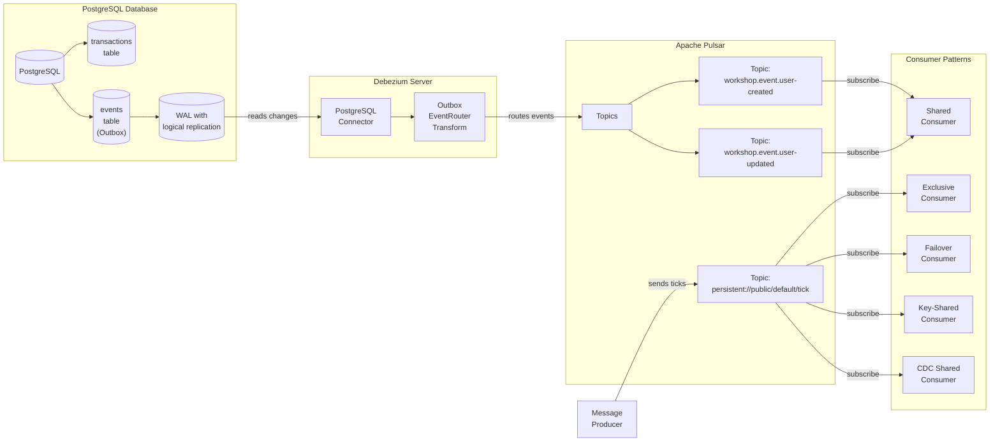

## Workshop File Structure

```
workshop-cdc/
├── clients/                       # Client applications directory
│   ├── cdc_consumer.py            # Consumer for CDC events
│   ├── exclusive_consumer.py      # Exclusive subscription example
│   ├── failover_consumer.py       # Failover subscription example
│   ├── key_shared_consumer.py     # Key-Shared subscription example
│   ├── producer.py                # Stock ticker producer
│   └── shared_consumer.py         # Shared subscription example
├── conf/                         # Debezium configuration
│   ├── application.properties    # Main Debezium config
│   ├── connectors/               # Connector plugins
├── data/                         # Debezium data directory
├── docker-compose.yml            # Docker configuration
├── postgres-with-logical-repl.conf # PostgreSQL config for CDC
├── README.md                     # Workshop documentation
├── requirements.txt              # Python dependencies
├── startup.sh                    # PostgreSQL initialization script
└── workshop.sh                   # Helper script for setup
```

This workshop demonstrates advanced event-driven architecture patterns using Apache Pulsar, PostgreSQL, and Debezium. The workshop is divided into two main parts:

1. **Part 1: Apache Pulsar Messaging Patterns** - Learn about Pulsar's messaging capabilities and different consumer models
2. **Part 2: Change Data Capture with the Outbox Pattern** - Implement CDC using Debezium and the Outbox pattern

## Workshop Architecture

The following diagram illustrates the overall architecture of the workshop:



## Prerequisites

- Docker and Docker Compose
- Python 3.x (for running consumers)
- Basic knowledge of PostgreSQL, Pulsar, and Debezium

## Setup

1. Clone the repository:
   ```bash
   git clone <repository-url>
   cd workshop-cdc
   ```

2. Use the workshop helper script to set up the environment:
   ```bash
   chmod +x workshop.sh  # Make the script executable
   ./workshop.sh setup
   ```

   This will:
   - Start all required Docker containers
     - PostgreSQL 17 with logical replication enabled
     - Apache Pulsar 3.1.1 in standalone mode
     - Debezium Server 2.7 configured for PostgreSQL
   - Create a Python virtual environment
   - Install all required dependencies

3. Activate the Python virtual environment:
   ```bash
   # On Linux/Mac
   source venv/bin/activate
   
   # On Windows
   venv\Scripts\activate
   ```

Alternatively, you can set up manually:

1. Start the environment using Docker Compose:
   ```bash
   docker-compose up -d
   ```

2. Create and activate a Python virtual environment:
   ```bash
   python -m venv venv
   source venv/bin/activate  # On Linux/Mac
   # OR
   venv\Scripts\activate     # On Windows
   ```

3. Install Python requirements for clients:
   ```bash
   pip install -r requirements.txt
   ```

## Part 1: Apache Pulsar Messaging Patterns

In the first part of this workshop, we'll explore Apache Pulsar's different consumer subscription types and understand their behaviors and use cases.

### Exercise 1: Understanding Pulsar Message Production

1. Start the stock ticker producer:
   ```bash
   cd clients
   python producer.py
   ```

   The producer will send messages with stock symbols and prices to the topic `persistent://public/default/tick`. Each message includes:
   - A stock symbol (AAPL, MSFT, GOOG, etc.)
   - A random price
   - A timestamp
   - The symbol is used as the message key

2. Observe the messages being sent to Pulsar.

### Exercise 2: Exclusive Consumer

Exclusive consumer is the default consumption mode where only one consumer can attach to a subscription.

1. Keep the producer running in one terminal.

2. In a new terminal, run:
   ```bash
   cd clients
   python exclusive_consumer.py
   ```

3. Observe the consumer receiving all messages from the producer.

4. Open a third terminal and run another instance of the exclusive consumer:
   ```bash
   cd clients
   python exclusive_consumer.py
   ```

5. **What happens?** You'll see the second consumer fail with an error because the subscription is already in use.

6. **Use case discussion:** When would you use an exclusive consumer? (Single consumer scenarios, ordered processing, simple applications)

### Exercise 3: Failover Consumer

Failover consumers allow multiple consumers to connect to a subscription, but only one processes messages at a time.

1. Stop any running consumers from previous exercises (Ctrl+C).

2. In two separate terminals, start two failover consumers:
   ```bash
   cd clients
   python failover_consumer.py
   ```

3. Notice that only one consumer is actively receiving messages.

4. **Experiment:** Stop the active consumer (Ctrl+C). What happens to the second consumer?

5. **Use case discussion:** When is failover consumption appropriate? (High availability, active-passive setups, ordered processing with backup)

### Exercise 4: Shared Consumer

Shared consumers distribute messages across all active consumers in a round-robin fashion.

1. Stop any running consumers from previous exercises.

2. Start two or three shared consumers in separate terminals:
   ```bash
   cd clients
   python shared_consumer.py
   ```

3. Observe how messages are distributed among all consumers.

4. **Experiment:** Start additional consumers and see how the workload is redistributed.

5. **Use case discussion:** When would you use shared consumption? (Load balancing, scaling processing, throughput optimization)

### Exercise 5: Key-Shared Consumer

Key-shared consumers ensure that messages with the same key are always delivered to the same consumer.

1. Stop any running consumers from previous exercises.

2. Start two or three key-shared consumers in separate terminals:
   ```bash
   cd clients
   python key_shared_consumer.py
   ```

3. **Important observation:** Watch the "Symbols seen by this consumer" output from each consumer.

4. Notice that specific symbols are consistently routed to the same consumer instance, even though there are multiple consumers.

5. **Experiment:** Stop one consumer and see how keys are redistributed.

6. **Use case discussion:** When is key-shared consumption valuable? (Ordered processing per key, session affinity, transaction processing)

## Part 2: Change Data Capture with the Outbox Pattern

In this part, we'll explore Change Data Capture and the Outbox pattern, understanding how Debezium, PostgreSQL, and Pulsar work together to reliably capture and process data changes.

### Exercise 6: Understanding PostgreSQL Logical Replication

1. Connect to PostgreSQL:
   ```bash
   docker exec -it workshop-cdc-postgres-1 psql -U postgres
   ```

2. Examine the PostgreSQL configuration for logical replication:
   ```sql
   SHOW wal_level;  -- Should be 'logical'
   ```

3. Check the existing replication slots:
   ```sql
   SELECT * FROM pg_replication_slots;
   ```
   
   You should see the `transaction_cdc` slot that was created during setup.

4. Understand the WAL (Write-Ahead Log) position:
   ```sql
   SELECT pg_current_wal_lsn();
   ```
   
   This shows the current Log Sequence Number (LSN) in the Write-Ahead Log.

### Exercise 7: Implementing the Outbox Pattern

1. Start the CDC consumer in a new terminal:
   ```bash
   cd clients
   python cdc_consumer.py
   ```

2. Connect to PostgreSQL in another terminal:
   ```bash
   docker exec -it workshop-cdc-postgres-1 psql -U postgres
   ```

3. Examine the `events` table schema (our outbox table):
   ```sql
   \d events
   ```

4. Insert an event into the outbox table:
   ```sql
   INSERT INTO events (aggregatetype, aggregateid, payload)
   VALUES ('user', '123', '{"event": "user-created", "name": "John Doe"}');
   ```

5. Observe the CDC consumer receiving the event.

6. Insert events with different aggregatetypes:
   ```sql
   INSERT INTO events (aggregatetype, aggregateid, payload)
   VALUES ('order', '456', '{"event": "order-created", "amount": 100.50}');
   
   INSERT INTO events (aggregatetype, aggregateid, payload)
   VALUES ('product', '789', '{"event": "product-updated", "name": "Widget Pro"}');
   ```

7. Notice how Debezium routes these events to different Pulsar topics based on the `aggregatetype`.

### Exercise 8: Tracking Changes through WAL

1. In the PostgreSQL terminal, check the current WAL position:
   ```sql
   SELECT pg_current_wal_lsn();
   ```

2. Insert a new event:
   ```sql
   INSERT INTO events (aggregatetype, aggregateid, payload)
   VALUES ('user', '124', '{"event": "user-updated", "name": "Jane Smith"}');
   ```

3. Check the new WAL position:
   ```sql
   SELECT pg_current_wal_lsn();
   ```

4. See how the LSN has advanced.

5. Check the replication slot's progress:
   ```sql
   SELECT * FROM pg_replication_slots WHERE slot_name = 'transaction_cdc';
   ```

6. Note the `confirmed_flush_lsn` value - this shows how far Debezium has read in the WAL.

### Exercise 9: Transactional Consistency with Outbox

1. With the CDC consumer still running, start a transaction in PostgreSQL:
   ```sql
   BEGIN;
   
   -- Business operation
   INSERT INTO transactions (price, status) 
   VALUES (199.99, 'completed');
   
   -- Event in outbox (same transaction)
   INSERT INTO events (aggregatetype, aggregateid, payload)
   VALUES ('transaction', '999', '{"event": "transaction-completed", "price": 199.99}');
   
   -- Commit the transaction
   COMMIT;
   ```

2. Observe the CDC consumer receiving the event after the transaction is committed.

3. Now try a transaction that rolls back:
   ```sql
   BEGIN;
   
   -- Business operation
   INSERT INTO transactions (price, status) 
   VALUES (299.99, 'completed');
   
   -- Event in outbox (same transaction)
   INSERT INTO events (aggregatetype, aggregateid, payload)
   VALUES ('transaction', '1000', '{"event": "transaction-completed", "price": 299.99}');
   
   -- Roll back the transaction
   ROLLBACK;
   ```

4. Notice that no event is captured by CDC because the transaction was rolled back.

5. **Discussion:** How does this solve the dual-write problem in distributed systems?

### Exercise 10: Exploring Debezium Internals

1. Examine Debezium's logs to see its operations:
   ```bash
   docker logs workshop-cdc-debezium-1
   ```

2. Look for messages about:
   - Connection to PostgreSQL
   - Snapshot operations
   - WAL reading
   - Event transformation and routing

3. Find the Debezium configuration directory:
   ```bash
   ls -la conf/
   ```

4. Examine `application.properties` to understand how Debezium is configured:
   ```bash
   cat conf/application.properties
   ```

5. **Discussion:** How does Debezium transform events from the outbox table into Pulsar messages?

## Workshop Discussion Points

After completing the exercises, discuss these key points:

1. **Consumer Pattern Selection**
   - What are the advantages and disadvantages of each consumer type?
   - How would you decide which consumer type to use in a real application?

2. **Outbox Pattern Benefits**
   - How does the Outbox pattern ensure reliable event publishing?
   - What problems does it solve compared to direct event publishing?

3. **CDC Architecture**
   - How do PostgreSQL, Debezium, and Pulsar work together?
   - What are the performance and reliability considerations?

4. **Real-world Applications**
   - How could you apply these patterns in your own systems?
   - What other CDC use cases can you think of?

## Troubleshooting

- **PostgreSQL Connection Issues**: 
  - Verify PostgreSQL is running with `docker ps` 
  - Check logs with `docker logs workshop-cdc-postgres-1`
  - Connect directly: `docker exec -it workshop-cdc-postgres-1 psql -U postgres`

- **Debezium Not Capturing Events**: 
  - Check Debezium logs with `docker logs workshop-cdc-debezium-1`
  - Verify logical replication slot exists: 
    ```sql
    SELECT * FROM pg_replication_slots;
    ```
  - Check Debezium configuration in `conf/application.properties`

- **Pulsar Connection Issues**: 
  - Verify Pulsar is running with `docker ps` 
  - Check logs with `docker logs workshop-cdc-pulsar-1`
  - Check Pulsar status with `docker exec -it workshop-cdc-pulsar-1 bin/pulsar-admin brokers healthcheck`

- **Consumer Can't Connect**: 
  - Make sure Pulsar is accessible at `localhost:6650`
  - Test connectivity with `telnet localhost 6650`
  - Ensure your virtual environment is activated
  - Verify dependencies are installed: `pip list | grep pulsar-client`

- **Python Virtual Environment Issues**:
  - If you see "No module named pulsar", ensure your virtual environment is activated
  - Reinstall dependencies if needed: `pip install -r consumer/requirements.txt`

## Additional Resources

- [Debezium Documentation](https://debezium.io/documentation/)
- [Apache Pulsar Documentation](https://pulsar.apache.org/docs/3.1.x/concepts-overview/)
- [PostgreSQL Logical Replication](https://www.postgresql.org/docs/16/logical-replication.html)
- [Outbox Pattern](https://debezium.io/blog/2019/02/19/reliable-microservices-data-exchange-with-the-outbox-pattern/)
- [Pulsar's Subscription Types](https://pulsar.apache.org/docs/3.1.x/concepts-messaging/#subscription-types)
